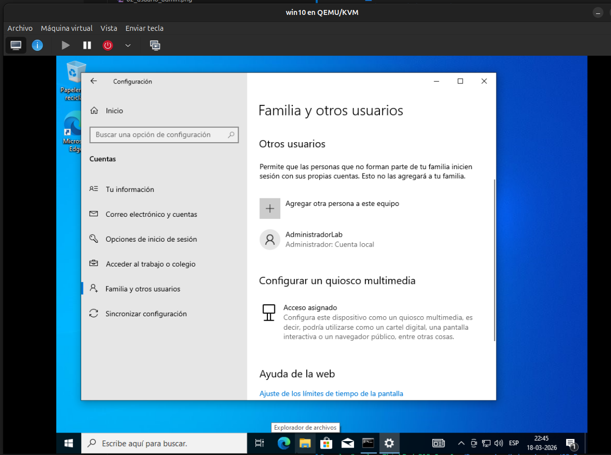
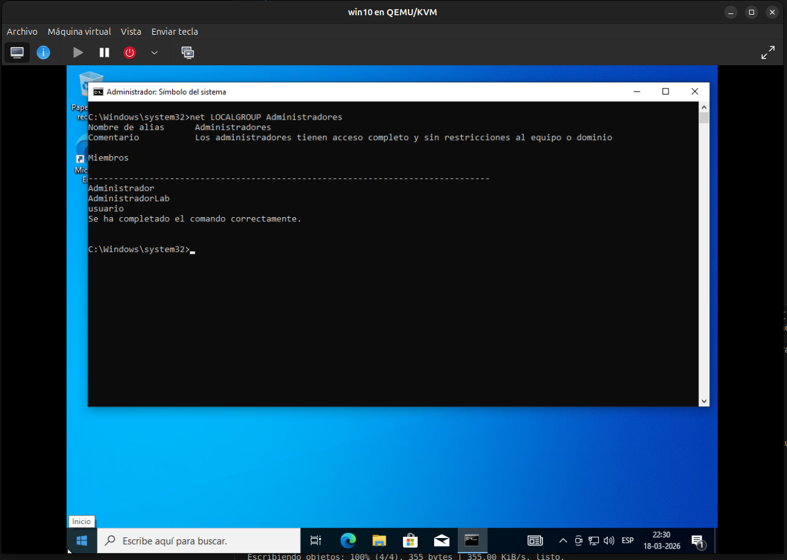
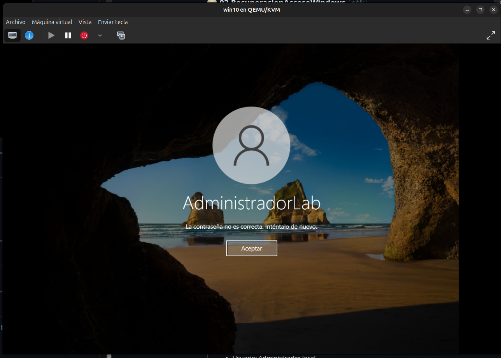

# ⚙️ 01 – Preparación del entorno

## 🎯 Objetivo

Configurar una máquina virtual con Windows 10 que simule un escenario realista de pérdida de acceso a una cuenta administrador.

---

## 🖥️ Entorno de trabajo

* Sistema Operativo: Windows 10 Pro
* Entorno: Máquina virtual (QEMU/KVM)
* Nombre de la VM: `win10`

---

## 👤 Creación de usuario administrador

Para evitar utilizar cuentas principales del sistema, se creó un usuario local con privilegios administrativos.

### Método utilizado: Línea de comandos

Se ejecutaron los siguientes comandos en una consola con privilegios de administrador:

```bash
net user AdministradorLab Password123! /add
net localgroup administrators AdministradorLab /add
```

### Descripción

* Se crea el usuario `AdministradorLab`
* Se asigna una contraseña inicial
* Se agrega el usuario al grupo de administradores del sistema

---

## 📸 Evidencia – Creación de usuario



---

## 🔐 Verificación de privilegios

Se verificó que el usuario pertenece al grupo de administradores mediante:

```bash
net localgroup administrators
```

---

## 📸 Evidencia – Usuario en grupo Administradores



---

## 🚫 Simulación de pérdida de acceso

Se configuró el entorno para simular la pérdida de acceso:

* Se cerró la sesión actual
* No se almacenó la contraseña
* No existen otras cuentas administrativas disponibles

---

## 📸 Evidencia – Pantalla de inicio de sesión



---

## 🧠 Observaciones

Este escenario representa una situación común en entornos reales donde la pérdida de credenciales administrativas puede bloquear completamente el acceso al sistema.

Esto evidencia la importancia de:

* Contar con mecanismos de recuperación seguros
* Implementar políticas de gestión de credenciales
* Evaluar riesgos asociados al acceso físico

---
